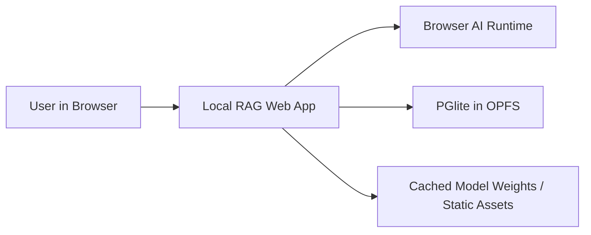
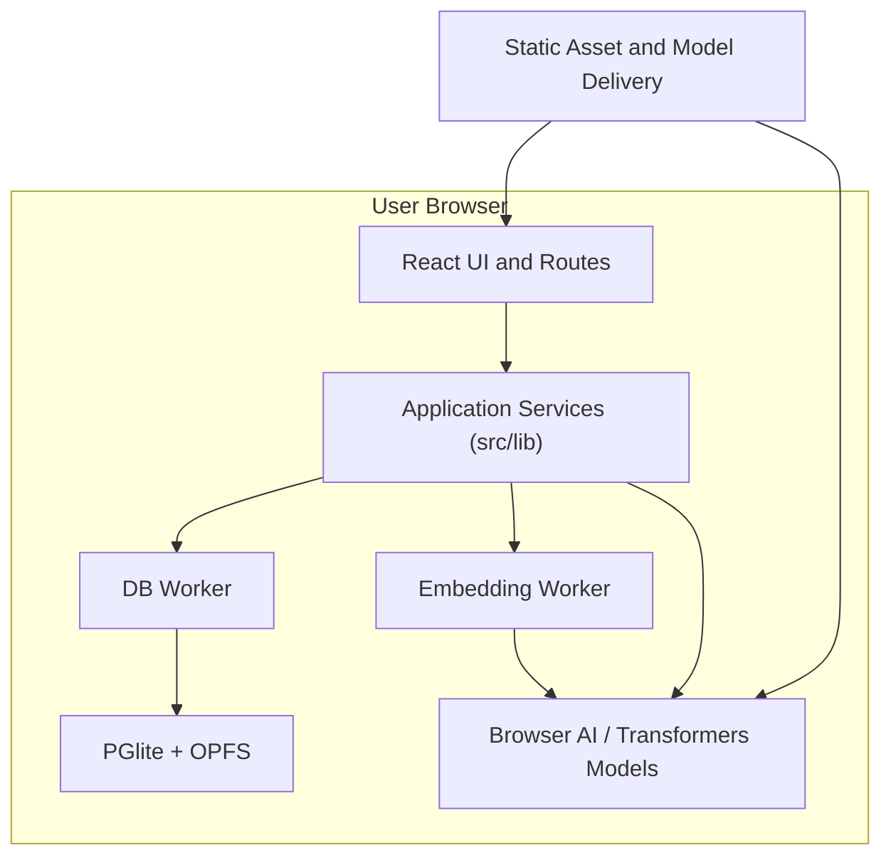
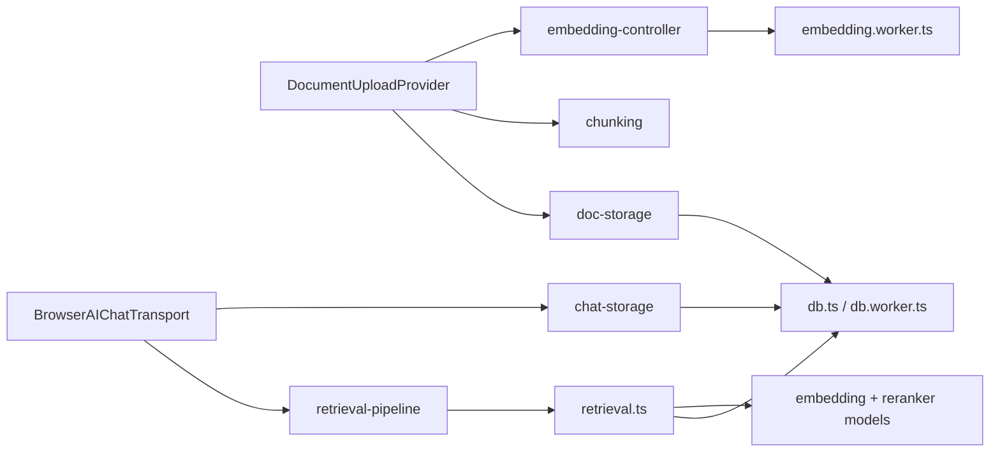

# Architecture

## 1. System Overview
- Purpose: deliver a local-first RAG application that ingests user documents, stores them in browser-local Postgres, retrieves relevant context, and answers questions with on-device models.
- Primary goals:
  - Keep document content, embeddings, chat history, and model execution in the browser.
  - Preserve UI responsiveness while running expensive work such as DB access, PDF parsing, embedding generation, and reranking.
  - Continue functioning offline after app assets and model weights are cached.
- Success criteria:
  - A user can upload Markdown and PDF files, retrieve relevant passages, and chat over them without any application backend.
  - Browser reloads preserve documents, vectors, settings, and chats.
  - Large or expensive operations do not block the React render thread.
- Non-goals:
  - Multi-user collaboration.
  - Server-side document storage or retrieval.
  - Cross-device sync.
  - Enterprise auth, RBAC, or remote observability pipelines.
- Assumptions:
  - This repo is intentionally single-user and local-only.
  - The app is delivered as a static Vite build; hosting does not provide business logic.

## 2. Architectural Style
- Chosen style: layered client application with worker-backed infrastructure boundaries.
- Why it fits:
  - The app is a browser product first, so the strongest boundary is between UI orchestration and heavy local infrastructure.
  - React routes/components handle presentation and workflows.
  - `src/lib/*` owns application services and domain rules.
  - `src/workers/*` isolates compute and storage engines from the main thread.
  - This keeps the codebase simple enough for a single app while still enforcing clear seams around expensive operations.

## 3. Domain Model and Modules
- `Document Ingestion`
  - Owns file upload, storage quota checks, blob persistence, chunking, embedding, and ingestion progress.
  - Primary files: `src/providers/document-upload.tsx`, `src/lib/doc-storage.ts`, `src/lib/chunking.ts`, `src/lib/embedding-controller.ts`.
- `Retrieval`
  - Owns query embedding, vector search, trigram search, reranking, thresholding, and chunk merging.
  - Primary files: `src/lib/retrieval.ts`, `src/lib/retrieval-pipeline.ts`, `src/lib/settings.ts`.
- `Chat`
  - Owns chat sessions, message persistence, attachment storage, title generation, summarization, and transport to browser AI models.
  - Primary files: `src/components/chat/*`, `src/lib/browser-ai-chat-transport.ts`, `src/lib/chat-storage.ts`.
- `Model Management`
  - Owns local model availability, warmup, cache clearing, and download UX for embedding, reranking, speech, whisper, and chat capabilities.
  - Primary files: `src/lib/models/*`, `src/components/model-download/*`.
- `Persistence`
  - Owns the browser-local Postgres instance, migrations, and typed schema.
  - Primary files: `src/lib/db.ts`, `src/lib/migrations.ts`, `src/db/schema.ts`, `src/workers/db.worker.ts`.
- `App Shell`
  - Owns routing, providers, theme, navigation, and page-level composition.
  - Primary files: `src/routes/*`, `src/router.tsx`, `src/routes/__root.tsx`, `src/components/SidebarNav.tsx`.

## 4. Directory Layout
- `src/routes`
  - Route files only. They compose page-level UI and call into providers/hooks/services.
- `src/components`
  - Reusable UI only. Components may orchestrate user interactions, but persistence and model logic must stay in `src/lib` or providers.
- `src/components/chat`
  - Chat-specific UI and thin UI hooks.
- `src/providers`
  - Long-lived client workflow providers such as document upload.
- `src/hooks`
  - Small reusable UI hooks. No persistence or domain ownership here.
- `src/lib`
  - Application services, retrieval pipeline, storage adapters, and model orchestration.
- `src/lib/models`
  - Model-specific adapters and registry code.
- `src/workers`
  - Web Worker entrypoints only.
- `src/db`
  - Drizzle schema only.
- `drizzle`
  - Generated SQL migrations.
- `test`
  - Unit and integration-style tests for ingestion, retrieval, and migration boundaries.
- Rules:
  - New persistence tables require schema updates in `src/db/schema.ts` and a migration in `drizzle/`.
  - New heavy compute must run in a worker or browser-native model runtime, not inside React components.
  - Routes must not talk to PGlite directly; they go through `src/lib/*`.

## 5. Data Flow and Boundaries
- Document ingestion flow:
  - Route/UI triggers `DocumentUploadProvider`.
  - Provider calls `saveDocument` to persist the raw file as a Postgres large object.
  - Provider calls `processPdf` or `processMarkdown` to derive chunks.
  - Provider calls `saveChunks`.
  - Provider calls `embedDocument`, which batches unembedded chunks through `embedding.worker.ts`.
  - Embeddings are persisted to `chunk_embeddings`; chunk rows are marked embedded.
- Chat flow:
  - `ChatInterface` uses `BrowserAIChatTransport`.
  - Transport persists the latest user message.
  - Transport runs the retrieval pipeline for the latest user text.
  - Retrieval results are injected into the prompt as assistant context.
  - The browser AI model streams the answer.
  - Assistant messages, retrieval metadata, model-usage metadata, and attachments are persisted locally.
- Database flow:
  - Main thread code obtains a `PGliteWorker` client via `src/lib/db.ts`.
  - Migrations and extension setup happen during bootstrap.
  - The actual database engine lives behind `src/workers/db.worker.ts`.
- Boundaries:
  - UI never owns business state durability.
  - Workers do not render UI or reach into React state.
  - Model registry and model adapters isolate all model-specific concerns from routes and components.

## 6. Cross-Cutting Concerns
- Authn/authz:
  - None by design. This is a local single-user application with browser-owned state.
  - If remote sync is added later, auth must be introduced as a new architecture concern, not bolted into existing local services.
- Logging and observability:
  - Current default is browser console logging and UI error banners/toasts.
  - Keep logs local and low-volume. Do not add server telemetry assumptions to core flows.
- Error handling:
  - Domain services throw typed or plain errors.
  - UI converts failures into banners, dialogs, or toasts.
  - Cancellation uses `AbortController` in upload flows.
  - Database bootstrap failures are surfaced globally in the app shell.
- Configuration and secrets:
  - Configuration is compile-time via Vite env vars such as `VITE_CHUNK_MB`.
  - No application secrets should exist in the client bundle.
  - Any future remote integration must keep secrets off the client.

## 7. Data and Integrations
- Datastores:
  - Browser-local PGlite database persisted to OPFS under the `local-rag` filesystem name.
  - Postgres large objects store raw files and chat attachments.
- Core schema:
  - `documents`: document metadata plus large object pointer.
  - `document_chunks`: normalized text chunks and ingestion status.
  - `chunk_embeddings`: vector embeddings keyed by chunk and model.
  - `app_settings`: local runtime settings such as rerank threshold.
  - `chats`, `chat_messages`, `chat_message_parts`: persisted chat history and structured message parts.
- Database extensions:
  - `vector` for embeddings.
  - `pg_trgm` for keyword search.
  - `lo` for large-object storage.
- External/browser integrations:
  - `@browser-ai/core` for browser-native chat inference.
  - `@browser-ai/transformers-js` and `@huggingface/transformers` for local model execution.
  - LangChain loaders/splitters for PDF and Markdown parsing.
  - `pdfjs-dist` assets copied into the build for browser PDF handling.
- Integration pattern:
  - Wrap external libraries in `src/lib/*` adapters or workers.
  - Do not leak raw third-party APIs throughout components.

## 8. Deployment and Environments
- Runtime:
  - Vite + TanStack Router application with a browser-only runtime.
  - Core product behavior remains client-side after the static assets load.
- Hosting:
  - Local development via Vite dev server.
  - Production deployment via any static host that rewrites unknown app routes to the entry document.
- Environments:
  - Development:
    - Hot reload, local browser storage, local worker execution.
  - Production:
    - Same local-first execution model, optimized static assets, static app shell.
- Configuration differences:
  - Environment differences should affect delivery and asset settings only.
  - Retrieval, storage, and chat behavior should remain consistent across environments.

## 9. Key Design Decisions
- Use browser-local Postgres instead of IndexedDB abstractions.
  - Rationale: one query model for metadata, vectors, trigram search, and large objects.
  - Trade-off: larger runtime payload and more careful WASM/asset setup.
- Run the database behind a Web Worker.
  - Rationale: prevent DB startup and queries from blocking the UI.
  - Trade-off: all DB access becomes async and worker-mediated.
- Store source files and chat attachments as Postgres large objects.
  - Rationale: keep all durable user state in one local store.
  - Trade-off: blob lifecycle cleanup must be handled explicitly.
- Use hybrid retrieval plus reranking.
  - Rationale: factual queries need more than pure vector similarity.
  - Trade-off: more moving parts and more model/runtime cost.
- Keep model lifecycle centralized in a registry.
  - Rationale: one place for readiness, cache management, and UX metadata.
  - Trade-off: model-specific edge cases must fit the registry contract.
- Persist chats as structured message parts, not a single blob.
  - Rationale: supports text, reasoning, retrieval metadata, model usage, and file attachments.
  - Trade-off: more tables and mapping logic.

## 10. Diagrams (Mermaid)
- C4 level 1: system context

- C4 level 2: containers

- Component diagram: ingestion and retrieval core

## 11. Forbidden Patterns
- Do not add a remote application backend for core RAG flows without a deliberate architecture change.
- Do not access PGlite directly from routes or UI components.
- Do not run embedding, reranking, or other heavy local inference inside React render paths.
- Do not duplicate model selection, warmup, or cache logic outside `src/lib/models/*` and worker clients.
- Do not create parallel persistence layers for the same domain data.
- Do not store secrets in Vite env vars meant for the client.
- Do not hand-edit generated route or migration output.
- Do not mix raw third-party API calls into presentation components when an adapter belongs in `src/lib/*`.

## 12. Open Questions
- Should chat inference remain tied to browser-native Gemini Nano, or should the app define a formal abstraction for multiple local chat backends?
- Should document ingestion move chunking into a worker as PDF and Markdown sizes grow?
- Is the current local-only architecture permanent, or should the codebase reserve a clean seam for optional sync/export later?
- Should retrieval settings expand beyond rerank threshold into explicit candidate-count and search-strategy tuning?
- What browser support floor is required for OPFS, Web Workers, and browser AI APIs?
