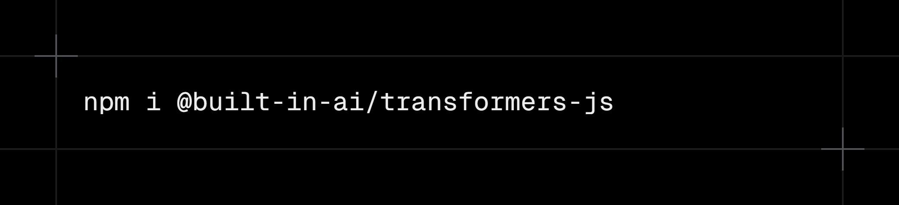

# Transformers.js provider for Vercel AI SDK

<div align="center">

</div>

<div align="center">

[](https://www.npmjs.com/package/@built-in-ai/transformers-js)
[](https://www.npmjs.com/package/@built-in-ai/transformers-js)

> [!NOTE]
> This library is in active development. Expect frequent updates.

</div>

[Transformers.js](https://github.com/xenova/transformers.js) provider for the [Vercel AI SDK](https://ai-sdk.dev/). Run popular open-source 🤗 Transformers models directly in the browser OR even server-side.

## Installation

```bash
npm i @built-in-ai/transformers-js
```

The `@built-in-ai/transformers-js` package is the AI SDK provider for Transformers models powered by the official `@huggingface/transformers` library. It supports both client-side (browser) and server-side (Node.js) inference.

## Requirements

### Browser (Client-side)

- A modern browser with WebAssembly/WebGPU support
- WebGPU is strongly recommended for optimal performance

### Server (Node.js)

- Node.js 18+ recommended
- Automatic CPU inference
- GPU acceleration available with appropriate hardware setup

## Usage

### Basic Usage (chat)

```typescript
import { streamText } from "ai";
import { transformersJS } from "@built-in-ai/transformers-js";

const result = streamText({
  // or generateText
  model: transformersJS("HuggingFaceTB/SmolLM2-360M-Instruct"),
  messages: [{ role: "user", content: "Hello, how are you?" }],
});

for await (const chunk of result.textStream) {
  console.log(chunk);
}
```

### JSON Response Format (Experimental)

You can request the model to output JSON by providing a `responseFormat` with a schema. This uses prompt engineering to guide the model and performs client-side validation using Zod.

> [!WARNING]
> This feature relies on the model's ability to follow instructions. Smaller models (< 1B parameters) may struggle to produce valid JSON consistently.

```typescript
import { generateObject } from "ai";
import { transformersJS } from "@built-in-ai/transformers-js";
import { z } from "zod";

const result = await generateObject({
  model: transformersJS("HuggingFaceTB/SmolLM2-360M-Instruct"),
  schema: z.object({
    recipe: z.object({
      name: z.string(),
      ingredients: z.array(z.object({
        name: z.string(),
        amount: z.string()
      })),
      steps: z.array(z.string())
    })
  }),
  prompt: "Generate a recipe for chocolate chip cookies.",
});

console.log(result.object);
```

#### Strict Mode

By default, if the model output is not valid JSON or does not match the schema, the provider will emit a warning and return the raw text. You can enforce strict validation by enabling the `failHard` option (if supported by your AI SDK version) or by checking warnings.

Currently, this provider implements a custom `responseFormatFailHard` option in `generationOptions` (passed internally) to throw errors on failure.

#### How it works

1.  **Prompt Injection**: The Zod schema is converted to a simplified JSON schema and injected into the system prompt.
2.  **Streaming Extraction**: A robust JSON fence detector extracts JSON objects from the stream in real-time.
3.  **Client-side Validation**: The final output is parsed and validated against the Zod schema.

### Tool calling

> Be aware that some models might struggle with this.
> If you want to try it out with best succes, I suggest using a reasoning model (Qwen3).

```ts
const result = streamText({
  model: transformersJS("onnx-community/Qwen3-0.6B-ONNX"),
  tools: {
    weather: tool({
      description: "Get the weather in a location",
      inputSchema: z.object({
        location: z.string().describe("The location to get the weather for"),
      }),
      execute: async ({ location }) => ({
        location,
        temperature: 72 + Math.floor(Math.random() * 21) - 10,
      }),
    }),
  },
  stopWhen: stepCountIs(5),
  prompt: "What is the weather in San Francisco?",
});
```

And then in your useChat use `sendAutomaticallyWhen: lastAssistantMessageIsCompleteWithToolCalls`.

### Server-side Inference

Although Transformers.js was originally designed to be used in the browser, it's also able to run inference on the server. This enables hybrid applications where you can seamlessly switch between client-side and server-side inference.

#### Basic Server-side Usage

```typescript
// In a Next.js API route (app/api/chat/route.ts)
import { streamText } from "ai";
import { transformersJS } from "@built-in-ai/transformers-js";

export async function POST(req: Request) {
  const { messages } = await req.json();

  const model = transformersJS("HuggingFaceTB/SmolLM2-135M-Instruct"); // Be mindful not to pick a too large model

  const result = streamText({
    model,
    messages,
    temperature: 0.7,
  });

  return result.toUIMessageStreamResponse();
}
```

#### Hybrid Client/Server Setup

You can create applications that automatically choose between client-side and server-side inference:

```typescript
import {
  transformersJS,
  doesBrowserSupportTransformersJS,
} from "@built-in-ai/transformers-js";

const useClientSide = doesBrowserSupportTransformersJS();

if (useClientSide) {
  // Browser: Use WebGPU for fast client-side inference
  const model = transformersJS("HuggingFaceTB/SmolLM2-360M-Instruct", {
    device: "webgpu",
    worker: new Worker(new URL("./worker.ts", import.meta.url), {
      type: "module",
    }),
  });
} else {
  // Fallback: Use server-side API route
  // (handled by your application routing)
}
```

Look at the [Complete Hybrid Example section](#complete-hybrid-example) for more information.

### Vision Models

```typescript
import { streamText } from "ai";
import { transformersJS } from "@built-in-ai/transformers-js";

const model = transformersJS("HuggingFaceTB/SmolVLM-256M-Instruct", {
  isVisionModel: true,
  device: "webgpu",
});

const result = streamText({
  model,
  messages: [
    {
      role: "user",
      content: [
        { type: "text", text: "Describe this image" },
        { type: "image", image: someImageBlobOrUrl },
      ],
    },
  ],
});
```

### Advanced Usage (Web Worker)

Heavy model execution should preferably run off the main thread using Web Workers.
This package ships a ready-to-use handler, which removes complexity and allows you to just build your app.

1. Create `worker.ts`:

```ts
import { TransformersJSWorkerHandler } from "@built-in-ai/transformers-js";

const handler = new TransformersJSWorkerHandler();
self.onmessage = (msg: MessageEvent) => {
  handler.onmessage(msg);
};
```

2. Provide the worker when creating the model:

```ts
import { streamText } from "ai";
import { transformersJS } from "@built-in-ai/transformers-js";

const model = transformersJS("HuggingFaceTB/SmolLM2-360M-Instruct", {
  worker: new Worker(new URL("./worker.ts", import.meta.url), {
    type: "module",
  }),
  device: "webgpu",
});

const result = streamText({
  model,
  messages: [{ role: "user", content: "Explain Web Workers briefly." }],
});

for await (const chunk of result.textStream) {
  console.log(chunk);
}
```

## Download Progress Tracking (browser)

When a model is first used, weights and tokenizer files must be loaded. Progress is handled internally and streamed back.

### Basic Progress Monitoring

```ts
import { streamText } from "ai";
import { transformersJS } from "@built-in-ai/transformers-js";

const model = transformersJS("HuggingFaceTB/SmolLM2-360M-Instruct");
const availability = await model.availability();

if (availability === "downloadable") {
  await model.createSessionWithProgress(({ progress }) => {
    console.log(`Download progress: ${Math.round(progress * 100)}%`);
  });
}

// Ready to use
const result = streamText({
  model,
  messages: [{ role: "user", content: "Hello!" }],
});
```

## Integration with useChat Hook

When using this library with the `useChat` hook, you can create hybrid applications that seamlessly switch between client-side and server-side inference.

See the complete working example in `examples/next-hybrid/` which includes:

- **Automatic fallback**: Client-side when supported, server-side otherwise
- **Download progress**: Real-time progress tracking for model downloads
- **Error handling**: Graceful error handling and notifications
- **Full integration**: Complete integration with `useChat` hook

## Embeddings

This package supports text embeddings using Transformers.js with full type safety and proper tensor handling.

### Basic Embedding Usage

```typescript
import { embed, embedMany } from "ai";
import { transformersJS } from "@built-in-ai/transformers-js";

// Single embedding
const { embedding } = await embed({
  model: transformersJS.textEmbedding("Supabase/gte-small"),
  value: "sunny day at the beach",
});

console.log(`Dimensions: ${embedding.length}`); // 384 for gte-small

// Multiple embeddings with automatic chunking
const { embeddings } = await embedMany({
  model: transformersJS.textEmbedding("Supabase/gte-small"),
  values: [
    "sunny day at the beach",
    "rainy afternoon in the city",
    "snowy night in the mountains",
  ],
});

console.log(`Generated ${embeddings.length} embeddings`);
```

### Advanced Embedding Configuration

```typescript
const embeddingModel = transformersJS.textEmbedding("Supabase/gte-small", {
  device: "webgpu", // Use WebGPU for acceleration
  dtype: "q8", // Quantization level
  normalize: true, // Normalize embeddings (default: true)
  pooling: "mean", // Pooling strategy: 'mean', 'cls', or 'max'
  maxTokens: 512, // Maximum input tokens
});

const { embedding } = await embed({
  model: embeddingModel,
  value: "your text here",
});
```

### Embedding Progress Tracking

```typescript
const embeddingModel = transformersJS.textEmbedding("Supabase/gte-small");

// Check if model needs downloading
const availability = await embeddingModel.availability();

if (availability === "downloadable") {
  await embeddingModel.createSessionWithProgress(({ progress }) => {
    console.log(`Embedding model download: ${Math.round(progress * 100)}%`);
  });
}

// Now ready to use
const { embedding } = await embed({
  model: embeddingModel,
  value: "your text here",
});
```

## Transcription

This package supports audio transcription using Transformers.js models with type safety and proper audio handling.

### Basic Transcription Usage

```typescript
import { experimental_transcribe as transcribe } from "ai";
import { transformersJS } from "@built-in-ai/transformers-js";

// Basic transcription
const transcript = await transcribe({
  model: transformersJS.transcription("Xenova/whisper-base"),
  audio: audioFile,
});

console.log(transcript.text); // Transcripted text string
console.log(transcript.segments); // Array of segments with timestamps (if available)
console.log(transcript.language); // Detected language (if available)
console.log(transcript.durationInSeconds); // Audio duration (if available)
```

### Advanced Transcription Configuration

```typescript
const transcriptionModel = transformersJS.transcription("Xenova/whisper-base", {
  device: "webgpu", // Use WebGPU for acceleration
  dtype: "fp16", // Data type for model weights
  maxNewTokens: 448, // Maximum tokens to generate
  language: "en", // Language hint for better accuracy
  returnTimestamps: true, // Return segment timestamps
});

const transcript = await transcribe({
  model: transcriptionModel,
  audio: audioBuffer,
  providerOptions: {
    "transformers-js": {
      language: "fr", // Override language per request
      returnTimestamps: true, // Enable timestamps
      maxNewTokens: 512, // Override max tokens
    },
  },
});
```

### Transcription with Web Worker (Browser)

For better performance and to avoid blocking the main thread, you can run transcription in a Web Worker:

**1. Create a worker file (`worker.ts`):**

```typescript
import { TransformersJSTranscriptionWorkerHandler } from "@built-in-ai/transformers-js";

const handler = new TransformersJSTranscriptionWorkerHandler();
self.onmessage = (msg: MessageEvent) => {
  handler.onmessage(msg);
};
```

**2. Use the worker in your application:**

```typescript
// Create a Web Worker for off-main-thread processing
const worker = new Worker("/whisper-worker.js", { type: "module" });

const transcriptionModel = transformersJS.transcription(
  "onnx-community/whisper-base",
  {
    worker: worker,
    device: "webgpu",
  },
);

const transcript = await transcribe({
  model: transcriptionModel,
  audio: audioFile,
});

console.log(transcript.text);
```

That's it! The worker handler takes care of all the complex model loading, audio processing, and communication with the main thread.

### Transcription Progress Tracking

To also keep track of model loading in your app, you can use the `createSessionWithProgress` as shown below:

```typescript
const transcriptionModel = transformersJS.transcription("Xenova/whisper-base");

// Check if model needs downloading
const availability = await transcriptionModel.availability();

if (availability === "downloadable") {
  await transcriptionModel.createSessionWithProgress(({ progress }) => {
    console.log(`Transcription model download: ${Math.round(progress * 100)}%`);
  });
}

// Now ready to transcribe
const transcript = await transcribe({
  model: transcriptionModel,
  audio: audioData,
});
```

### Supported Audio Formats

The transcription model accepts audio in multiple formats:

```typescript
// Uint8Array (raw audio bytes)
const audioBytes = new Uint8Array(audioBuffer);
await transcribe({ model, audio: audioBytes });

// ArrayBuffer
const audioBuffer = await audioFile.arrayBuffer();
await transcribe({ model, audio: audioBuffer });

// Base64 encoded string
const audioBase64 = btoa(audioString);
await transcribe({ model, audio: audioBase64 });

// File from disk (Node.js)
const audioFile = await readFile("recording.wav");
await transcribe({ model, audio: audioFile });
```

## API Reference

### `transformersJS(modelId, settings?)`

Creates a Transformers.js language model instance.

Parameters:

- `modelId`: A Hugging Face model ID (e.g. `"HuggingFaceTB/SmolLM2-360M-Instruct"`, `"onnx-community/Llama-3.2-1B-Instruct-q4f16"`)
- `settings` (optional):
  - `device?: "auto" | "cpu" | "webgpu" | "gpu"` – Inference device (default: "auto")
  - `dtype?: "auto" | "fp32" | "fp16" | "q8" | "q4" | "q4f16"` – Data type for model weights (default: "auto")
  - `isVisionModel?: boolean` – Whether this is a vision model that can process images (default: false)
  - `worker?: Worker` – Optional Web Worker to run the model off the main thread (browser only)
  - `initProgressCallback?: (progress: { progress: number }) => void` – Progress callback for model initialization
  - `rawInitProgressCallback?: (progress: ProgressInfo) => void` – Raw progress callback from Transformers.js

Returns: `TransformersJSLanguageModel`

### `transformersJS.languageModel(modelId, settings?)`

Alias for `transformersJS(modelId, settings?)`. Creates a language model instance.

### `transformersJS.textEmbedding(modelId, settings?)`

Creates a Transformers.js embedding model instance with proper type safety.

Parameters:

- `modelId`: A Hugging Face embedding model ID (e.g. `"Supabase/gte-small"`, `"Xenova/all-MiniLM-L6-v2"`)
- `settings` (optional):
  - `device?: "auto" | "cpu" | "webgpu"` – Inference device (default: "auto")
  - `dtype?: "auto" | "fp32" | "fp16" | "q8" | "q4" | "q4f16"` – Data type for model weights (default: "auto")
  - `normalize?: boolean` (default: true) – Whether to normalize embeddings
  - `pooling?: "mean" | "cls" | "max"` (default: "mean") – Pooling strategy for token embeddings
  - `maxTokens?: number` (default: 512) – Maximum input tokens
  - `initProgressCallback?: (progress: { progress: number }) => void` – Progress callback for model initialization
  - `rawInitProgressCallback?: (progress: ProgressInfo) => void` – Raw progress callback from Transformers.js

Returns: `TransformersJSEmbeddingModel`

### `transformersJS.textEmbeddingModel(modelId, settings?)`

Alias for `transformersJS.textEmbedding(modelId, settings?)`. Creates an embedding model instance.

### `TransformersJSEmbeddingModel.availability()`

Checks current availability status for the embedding model.

Returns: `Promise<"unavailable" | "downloadable" | "available">`

### `TransformersJSEmbeddingModel.createSessionWithProgress(onProgress?)`

Creates/initializes an embedding model session with optional progress monitoring.

Parameters:

- `onProgress?: (p: { progress: number }) => void`

Returns: `Promise<TransformersJSEmbeddingModel>`

### `transformersJS.transcription(modelId, settings?)`

Creates a Transformers.js transcription model instance with proper type safety.

Parameters:

- `modelId`: A Hugging Face Whisper model ID (e.g. `"Xenova/whisper-base"`, `"openai/whisper-small"`, `"openai/whisper-large-v3"`)
- `settings` (optional):
  - `device?: "auto" | "cpu" | "webgpu"` – Inference device (default: "auto")
  - `dtype?: "auto" | "fp32" | "fp16" | "q8" | "q4"` – Data type for model weights (default: "auto")
  - `maxNewTokens?: number` (default: 448) – Maximum number of tokens to generate
  - `language?: string` – Language hint for better transcription accuracy
  - `returnTimestamps?: boolean` (default: false) – Return timestamps for segments
  - `worker?: Worker` – Optional Web Worker to run the model off the main thread (browser only)
  - `initProgressCallback?: (progress: { progress: number }) => void` – Progress callback for model initialization
  - `rawInitProgressCallback?: (progress: ProgressInfo) => void` – Raw progress callback from Transformers.js

Returns: `TransformersJSTranscriptionModel`

### `transformersJS.transcriptionModel(modelId, settings?)`

Alias for `transformersJS.transcription(modelId, settings?)`. Creates a transcription model instance.

### `TransformersJSTranscriptionModel.availability()`

Checks current availability status for the transcription model.

Returns: `Promise<"unavailable" | "downloadable" | "available">`

### `TransformersJSTranscriptionModel.createSessionWithProgress(onProgress?)`

Creates/initializes a transcription model session with optional progress monitoring.

Parameters:

- `onProgress?: (p: { progress: number }) => void`

Returns: `Promise<TransformersJSTranscriptionModel>`

### `TransformersJSTranscriptionWorkerHandler`

A worker handler class that simplifies running transcription models in Web Workers.

### `doesBrowserSupportTransformersJS(): boolean`

Checks if the browser supports TransformersJS with optimal performance. Returns `true` if the browser has WebGPU or WebAssembly support, `false` otherwise.

### `TransformersUIMessage`

Extended UI message type for use with the `useChat` hook that includes custom data parts.

Type:

```ts
type TransformersUIMessage = UIMessage<
  never,
  {
    modelDownloadProgress: {
      status: "downloading" | "complete" | "error";
      progress?: number;
      message: string;
    };
    notification: {
      message: string;
      level: "info" | "warning" | "error";
    };
  }
>;
```

### `TransformersJSLanguageModel.createSessionWithProgress(onProgress?)`

Creates/initializes a model session with optional progress monitoring.

Parameters:

- `onProgress?: (p: { progress: number }) => void`

Returns: `Promise<TransformersJSLanguageModel>`

### `TransformersJSLanguageModel.availability()`

Checks current availability status.

Returns: `Promise<"unavailable" | "downloadable" | "available">`

### `TransformersJSWorkerHandler`

Utility handler for Web Worker usage. Attach it to the worker `onmessage` to handle `load`, `generate`, `interrupt`, and `reset` messages.

```ts
import { TransformersJSWorkerHandler } from "@built-in-ai/transformers-js";

const handler = new TransformersJSWorkerHandler();
self.onmessage = (msg: MessageEvent) => handler.onmessage(msg);
```

## Author

2025 © Jakob Hoeg Mørk

## Credits

The Hugging Face, Transformers.js, and Vercel AI SDK teams
